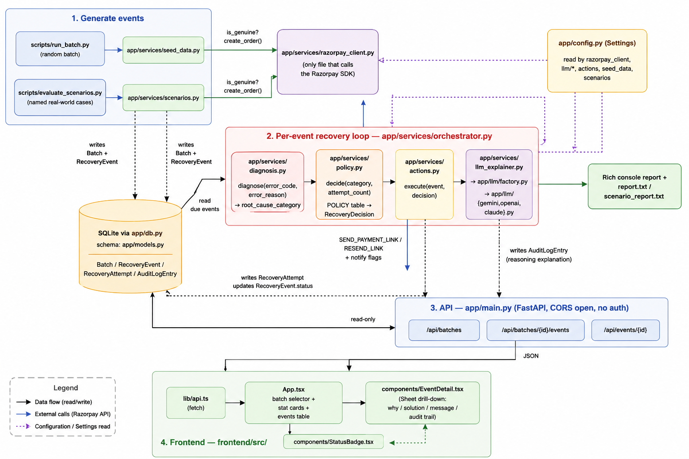

# AI Revenue Recovery Agent

Finds revenue a merchant is about to lose, failed subscription payments, abandoned
checkouts, diagnoses why, and runs a bounded recovery workflow (retry / resend a
payment link / escalate to a human), with hard stopping rules so it never blindly
retries something it shouldn't. Reports what was actually recovered, with an honest
list of what it couldn't fix and a full audit trail for every decision.

## Project structure

```
backend/    Python + FastAPI. The rule engine, Razorpay integration, LLM explanations,
            batch runner, and the JSON API the dashboard reads from.
frontend/   Vite + React + shadcn/ui. A read-only dashboard: what failed, why, what
            was done about it, and whether a message actually went out.
```

See [`backend/app/services/`](backend/app/services/) for the recovery pipeline itself:
`diagnosis.py` (classify the failure) → `policy.py` (decide what to do) → `actions.py`
(do it) → `orchestrator.py` (runs that loop per event until it reaches a final state).

## Prerequisites

- Python 3.12+
- Node.js 22.12+ and npm
- A [Razorpay](https://dashboard.razorpay.com/) account with **test mode** enabled (no
  business verification needed for test keys)
- An API key for one LLM provider: Gemini, OpenAI, or Claude

## Backend setup

```bash
cd backend
python3 -m venv .venv
.venv/bin/pip install -r requirements.txt
cp .env.example .env
```

Fill in `.env`:

| Variable | What it's for |
| --- | --- |
| `RAZORPAY_KEY_ID` / `RAZORPAY_KEY_SECRET` | Test-mode API keys from the Razorpay dashboard |
| `LLM_PROVIDER` | `gemini`, `openai`, or `claude` |
| `GEMINI_API_KEY` / `OPENAI_API_KEY` / `ANTHROPIC_API_KEY` | Key for whichever provider you picked (and its `_MODEL`) |
| `DEMO_PHONE_NUMBER` | optional-phone number to receive one real SMS/WhatsApp during a demo run.  |

Then run it:

```bash
.venv/bin/python scripts/run_batch.py              # seeds a random batch, runs the recovery loop, prints a report
.venv/bin/python scripts/evaluate_scenarios.py       # 9 named real-world scenarios, graded against expected behavior
.venv/bin/python -m pytest                            # unit tests for the rule engine
.venv/bin/uvicorn app.main:app --port 8000              # JSON API for the dashboard (localhost:8000)
```

## Frontend setup

With the backend API running on port 8000:

```bash
cd frontend
npm install
npm run dev   # http://localhost:5173
```

No auth, no build step needed for local use. It expects the API at
`http://localhost:8000` by default - set `VITE_API_URL` to override.

## How it fits together

1. `scripts/run_batch.py` or `evaluate_scenarios.py` seed events (optionally creating
   real Razorpay test-mode orders/links) and hand them to the orchestrator.
2. For each event: `diagnosis.py` classifies the failure from Razorpay's real error
   codes, `policy.py` looks up what to do (a small data table, not a black box),
   `actions.py` carries it out, calling Razorpay for real if the event is genuine,
   and logging every step to the audit trail.
3. `app/main.py` exposes that same database read-only over HTTP.
4. The frontend renders it as a table you can drill into per event.

## Agent Flow Diag
